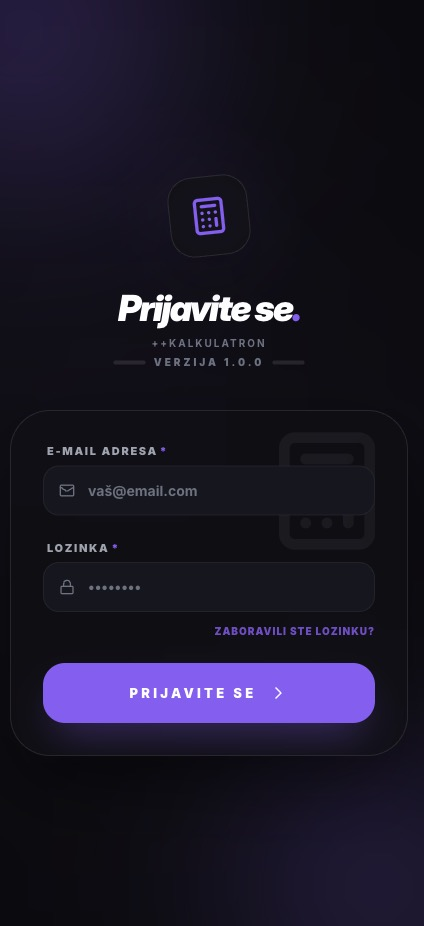
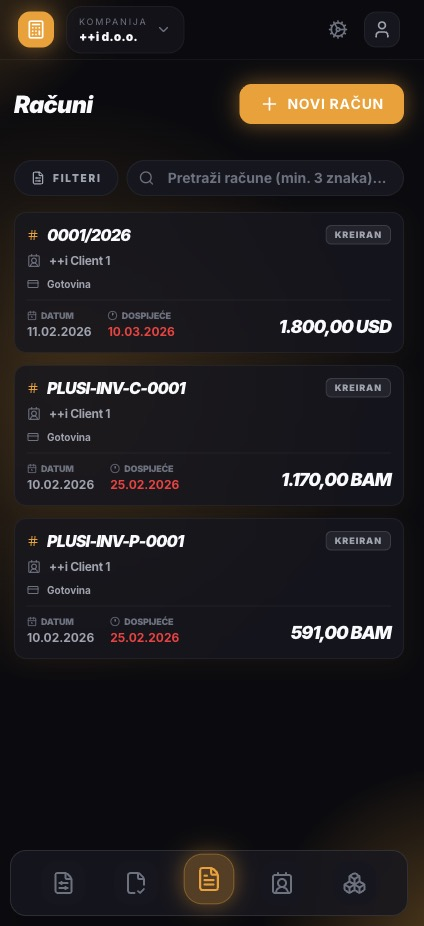
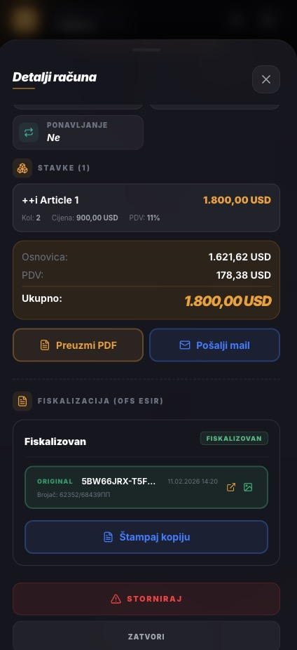
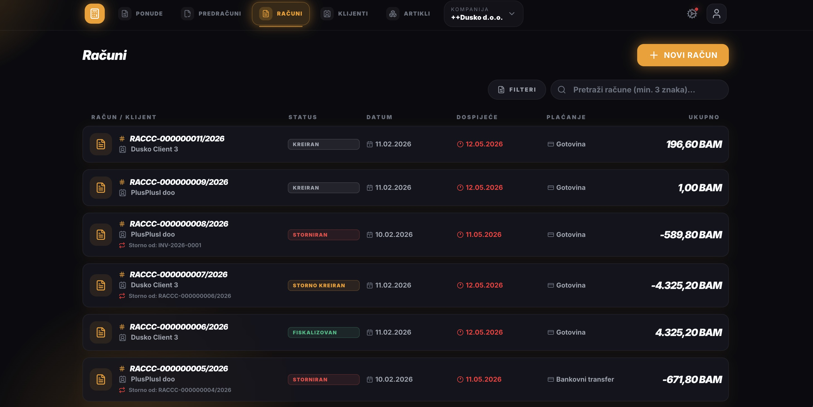

# ppKalkulatron

## Struktura projekta

- **ppKalkulatron-api/** - Laravel API backend
- **ppKalkulatron-pwa/** - React PWA frontend

## Pokretanje

1. Pokrenuti API backend (Sail)
2. Pokrenuti PWA frontend (npm run dev)

API će biti dostupan na `http://localhost`, a PWA na `http://localhost:5173`.

## Tehnologije

- **Backend**: Laravel 12, PHP 8.2+, MySQL, Sanctum
- **Frontend**: React Router 7, TypeScript, TailwindCSS, Vite

## Slika

